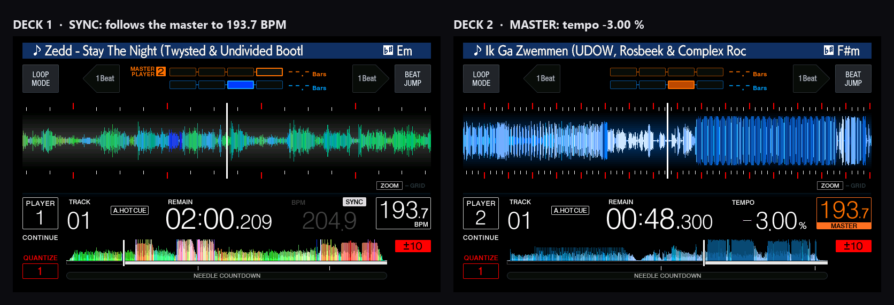
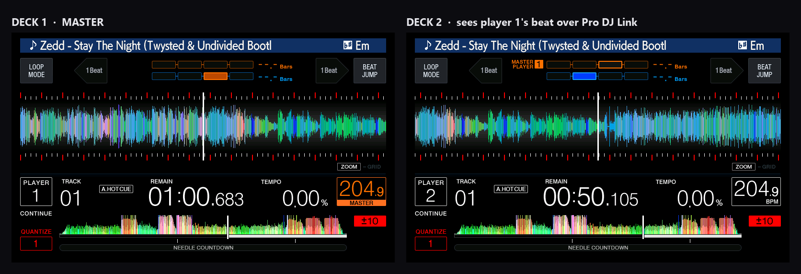
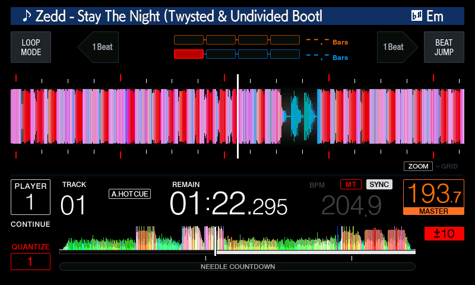
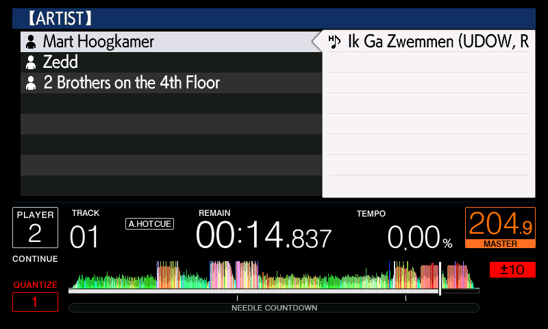
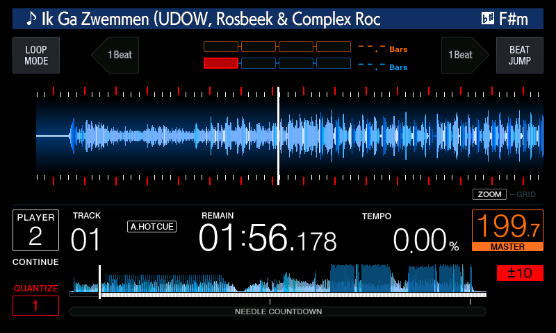
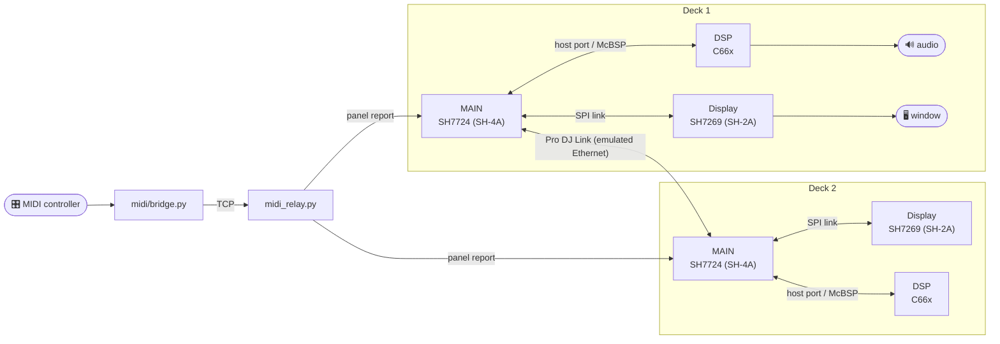

<div align="center">

# CDJ-2000NXS2 Emulator

**The firmware of a Pioneer DJ CDJ-2000NXS2, running unmodified on emulated hardware.**

[](LICENSE)
[](#quick-start)
[](https://www.qemu.org/)
[](#not-included)



</div>

It boots, mounts a virtual USB stick, and loads and plays tracks from it. The waveform
scrolls, the time counts down, and the sound you hear is computed by the
player's own DSP program on an emulated DSP. Start two and they find each other
on an emulated Pro DJ Link network, where MASTER and SYNC work between them.
Plug in a MIDI controller and it plays them.

## ✨ Features

| | |
|---|---|
| 🎛️ **The real firmware** | All three processors of the player run its own code: MAIN, the display board and the audio DSP. |
| 🔊 **The DSP's own sound** | A C66x emulator with a JIT runs the DSP program MAIN uploads at boot; the audio you hear is its output. |
| 📈 **Load and play** | A track from the stick loads and plays; the waveform and playhead move, the time counts down. |
| 🔗 **Pro DJ Link** | Two decks take their own addresses from a small DHCP server, announce themselves, and MASTER and SYNC work between them. |
| 🎚️ **Any MIDI controller** | A profile of what the controller sends plus a mapping to CDJ keys. A Roland DJ-202 mapping is included, with its LEDs mirroring the player's lamps. |
| 🌀 **Jog and touch** | The jog bends the DSP's playback speed through the firmware's own jog engine; a click in the window is a touch on the screen. |
| 🧪 **Built for modding** | Trace any firmware address, watch memory, change it while it runs, call firmware functions, script every input. |

<a id="not-included"></a>

## 🧭 Nothing from Pioneer DJ is included

> **This repository distributes no firmware, no ROM or flash images, no fonts,
> no artwork files and no manuals or schematics.** Everything here was written
> for this project. To run it you supply your own copy of the player's public
> firmware update file, which the setup unpacks on your machine, into a folder
> that is never committed.
>
> The screenshots below show the emulated firmware's own interface, running in
> this emulator, for illustration.
>
> This project is not affiliated with, endorsed by or supported by Pioneer DJ or
> AlphaTheta. Pioneer DJ, CDJ, rekordbox and PRO DJ LINK are trademarks of their
> respective owners.

<a id="quick-start"></a>

## 🚀 Quick start

**1. Get a shell for your system** (only your own line applies):

| system | what to do first |
|---|---|
| **Windows** | Install [MSYS2](https://www.msys2.org) and open the **MSYS2 MINGW64** shell. `setup.sh` tells you which packages to add. |
| **Linux** (native or WSL) | Nothing. Any shell will do; `setup.sh` prints the `apt` command for anything missing. |
| **macOS** (Apple silicon or Intel) | Install the Xcode Command Line Tools and [Homebrew](https://brew.sh), then the build tools and a newer bash (macOS's own is 3.2; the scripts find Homebrew's by themselves): `xcode-select --install` then `brew install bash ninja meson pkgconf glib pixman python` |

**2. Clone and run setup** (the same on every system):

```sh
git clone <this repository> cdj-nxs2
cd cdj-nxs2
./setup.sh
```

`setup.sh` walks you through six steps. Every one is safe to re-run and is
skipped when it is already done:

1. **Prerequisites** — checks compilers, libraries and Python packages, and
   prints the exact `pacman`, `apt` or `brew` command for whatever is missing.
2. **Build** — fetches QEMU 9.1.0, applies this project's patches and builds
   the MAIN emulator, the display-board emulator and the DSP library, with a
   progress line per phase and full logs in `logs/` (10–40 minutes).
3. **Firmware** — asks for your `C2KNXS2.UPD`, Pioneer DJ's public update for
   the CDJ-2000NXS2, **version 1.87**, and turns it into the images the
   emulator boots, checking each against a known SHA-256.
4. **USB stick** — asks for a folder of your own music exported by rekordbox
   (the folder that holds `PIONEER/`) and builds a disk image of it.
5. **DSP code** — boots one deck without a window and lets it play a track for
   a few minutes while MASTER TEMPO and the tempo fader are swept, so the DSP's
   JIT compiles the program's hot code into its cache (`~/c14gen`) and your
   first real session already keeps up (about 15 minutes).
6. **Your setup** — one deck or two, Pro DJ Link, sound, a MIDI controller;
   saved to `cdj.conf`.

**3. Play:**

```sh
./start.sh          # Ctrl-C stops everything
```

The deck window opens and the player boots to its screen. Click the window,
press `U` for the USB stick, `↓` to a track, `Enter` to load it and `Space` to
play (every key: [Keyboard](#keyboard)). Click the screen to touch it.

**Updating:** `git pull`, then `./start.sh` as usual. The emulator is compiled,
so when a pull changed its code `start.sh` notices and offers to rebuild
(`./build.sh main display` does the same by hand).

**You will need** a recent multi-core CPU (see [Limits](#limits)),
about 3 GB of disk for the build trees and the DSP code cache, Python 3.11 or
newer, the update file (v1.87 — every address in the model is for that
version), and your own music.

<details>
<summary><b>On macOS</b></summary>

- The deck window is QEMU's native **Cocoa** window and the sound goes to the
  default output through **Core Audio**; neither needs anything from
  Homebrew. `GUI_DISPLAY=sdl` and `AUDIODEV=...` choose others, as elsewhere.
- **Pro DJ Link** runs over multicast on your network interface. The first
  time, macOS may ask whether your terminal may find devices on the local
  network: allow it, or the two decks will not see each other.
- The DSP JIT compiles with Apple's clang (`gcc` on macOS is clang), and
  `--curated-jit` uses clang's own profile-guided build with Xcode's
  `llvm-profdata`.
- Python packages go into `.venv/` in this folder, since Homebrew's Python
  refuses `pip install` outside a virtual environment; setup offers the exact
  command. QEMU 9.1's configure needs `distlib`, which current `pip` no longer
  carries, so the build makes itself a small venv with it in the build tree.
- Over `ssh`, with no desktop session, the decks run without a window.

</details>

<details>
<summary><b>Setup options</b></summary>

```text
./setup.sh --dry-run            show every step and command, change nothing
./setup.sh --reconfigure        ask the "your setup" questions again
./setup.sh --yes                never ask; take the defaults and the options below
./setup.sh --skip-build         leave the build out (a build tree you made yourself)
./setup.sh --rebuild            build even when the emulators are already built
./setup.sh --no-warm            leave the DSP warm-up out
./setup.sh --warm               warm the DSP code cache again
./setup.sh --curated-jit        build a profile-guided DSP module instead (about an hour)
  --keep-recording              keep that build's DSP recording (~10 GB)
  --firmware <file>             the C2KNXS2.UPD to use (re-installs the images)
  --music <folder>              the rekordbox USB export to image
  --decks 1|2   --name <deck name>   --djlink on|off   --audio on|off
  --controller none|<profile>|learn  --relay-port <port>
  --build-dir <dir>             where the two QEMU build trees go

./start.sh stop                 stop a running rig from another shell
./start.sh --dry-run            show what would be started
./build.sh [source|patches|main|display|dsp]   one build phase at a time
```

</details>

## 📸 Screenshots

<table>
  <tr>
    <td align="center"><br><sub>Deck 2 tracks the master's beat over Pro DJ Link</sub></td>
    <td align="center"><br><sub>MASTER TEMPO and SYNC, colour waveform</sub></td>
  </tr>
  <tr>
    <td align="center"><br><sub>Browsing the other player's USB over the link</sub></td>
    <td align="center"><br><sub>...and playing a track loaded from it</sub></td>
  </tr>
</table>

## ⚙️ How it works

A CDJ-2000NXS2 is three computers in one box, and all three run here:

| chip | job in the player | here |
|---|---|---|
| Renesas SH7724 (SH-4A) | **MAIN**: transport, file system, rekordbox database, Pro DJ Link, the front panel | QEMU's SH-4 with a board model written for this project (`hw/cdj/`) |
| Renesas SH7269 (SH-2A) | the **display processor**: draws the 7-inch screen from what MAIN sends it | a second, big-endian QEMU with its own board model (`hw/cdj/sh7269gui.c`) and a window on your desktop |
| TI TMS320C6655 (C66x) | the **DSP**: decodes the track, time-stretches it, produces the audio | a C66x core written for this project (`hw/cdj/c6x/`), running the program MAIN uploads to it at boot |



None of the three knows it is emulated. MAIN talks to the display processor
over the same SPI link, to the DSP over the same host port and McBSP audio bus,
and reads its front panel through the same report from the panel
microcontroller as on the real board. The models were written device by
device, from what the firmware actually touches.

**How it was done.** By reverse engineering, under QEMU, one blocked boot at a
time. The firmware update was unpacked (its container, the LZSS packing of the
MAIN and display images, the resource archives), and the boards were modelled
wherever the firmware stopped: interrupt controllers, DMA, I²C, the USB host
controller, the Ethernet MAC, the SPI link between the two processors, the
DSP's boot path and command protocol. The firmware turned out to be its own
best documentation: it logs to an internal ring, it names its tasks, its keys
and its errors, and a trace hook at any firmware address plus a memory watch
said the rest.

**The DSP** needed the most work. There is no usable C66x emulator, so this
project has its own: a VLIW core that issues up to eight instructions a cycle,
with the SoC peripherals the program uses. Interpreted, it is far too slow for
real-time audio, so a **JIT** compiles the hot parts of the DSP program to
native code while you play (`hw/cdj/c6x/tools/`), caching what it has built.
The instruction decode tables come from GNU binutils.

<a id="keyboard"></a>

## ⌨️ Keyboard

No controller needed: click a deck's window and play it from the keyboard.
Each window drives its own deck.

| key | does | key | does |
|---|---|---|---|
| `Space` | PLAY/PAUSE | `C` | CUE (held, as on the deck) |
| `↑` / `↓` | turn the browse knob | `PgUp` / `PgDn` | ten rows at a time |
| `Enter` / `→` | push the knob: open a folder, load a track | `Esc` / `←` / `Backspace` | BACK |
| `,` / `.` | TRACK previous / next | `[` / `]` | SEARCH back / forward (held) |
| `-` / `=` | nudge slower / faster while held (`Shift` for more) | `Q` / `W` / `E` | LOOP IN / OUT / RELOOP |
| `B` | BROWSE | `M` | MENU (UTILITY) |
| `U` / `L` / `R` / `D` | USB / LINK / REKORDBOX / DISC source | `T` / `I` | TAG LIST / INFO |
| `S` | SYNC | `A` | MASTER |
| `K` | MASTER TEMPO | `P` | TEMPO RANGE |
| `V` | SLIP | `Z` | REVERSE |
| `J` | JOG MODE | | |

The mouse is the touch screen. A typical start: `U` (or click the source), `↓`
to a track, `Enter` to load, `Space` to play.

## 🎚️ MIDI controllers

**Using one:** plug the controller in before `./setup.sh`. Setup recognises a
controller it has a profile for (or offers to learn a new one) and saves your
choice, and from then on `./start.sh` starts the bridge together with the decks.
With two decks the controller's left side plays deck 1 and its right side deck 2.
The bridge's own output is in `logs/bridge.log`. On Windows it runs on a normal
Windows Python (python.org or the Microsoft Store) with `mido` and
`python-rtmidi` installed, because MSYS2's Python cannot open MIDI devices; setup
finds it and prints the one `pip` command it needs if the packages are missing.
On macOS the packages go into this folder's `.venv/` (setup prints that command
too), and the bridge reaches the controller through Core MIDI.

Any controller works as a **profile** (what the hardware sends,
`midi/controllers/<name>.json`) plus a **mapping** (which CDJ key each control
presses, `midi/mappings/<name>.json`). The Roland DJ-202 ships with both. For
another controller:

```sh
python midi/learn.py new                          # name it, move each control, name each one
python midi/learn.py map --controller <name>      # bind controls to CDJ actions
python midi/bridge.py --controller <name> --dry-run
```

Every key of the player's front panel can be mapped, including ones nothing
binds yet. `./setup.sh --reconfigure` offers the same walk-through. Details,
the mapping format and the full action catalogue: [`midi/README.md`](midi/README.md).

## 🧪 A platform for modding the firmware

Running the firmware is the first step; changing what the player does is the
next, and this is built for it. The emulator makes the whole machine
observable and every part of it adjustable, without touching a real deck:

| | |
|---|---|
| 🔍 **Watch it think** | `CDJ_FWLOG` prints the firmware's own internal log; `CDJ_FWTRACE=<address>,...` prints the registers each time execution passes an address; `CDJ_MWATCH=<address>` reports which instruction changed a memory word; QEMU's monitor dumps memory and the screen while it runs. |
| ✏️ **Change it while it runs** | `CDJ_MPOKE` holds memory at a value, `CDJ_PPOKE` writes one when a chosen instruction executes, and `CDJ_PCALL2` calls any firmware function from inside a running task. |
| 🕹️ **Drive it from outside** | Every front-panel key, the jog, the pots and the touch screen are one datagram away (`scripts/run/panel_key.py`, `midi/bridge.py`), so input can be scripted, remapped or generated. |
| 🔁 **Replay the DSP** | The DSP core can record its execution and replay it deterministically, which is what the JIT is tuned on and what a change to the audio path can be tested against. |

From here, new behaviour is a question of finding the right code and writing
the right change: remapping controls, adding features to the deck, studying the
Pro DJ Link protocol from a player that speaks it natively, or experimenting
with the audio chain. Keep what you derive from the firmware on your own
machine: the update file, and anything built from it, is Pioneer's.

<a id="limits"></a>

## ⚠️ Limits

- **Speed depends on your CPU.** One deck runs in real time on a fast desktop.
  Two decks need roughly twice that, and on a busy or modest machine they fall
  behind real time (the audio then has gaps).
- **The DSP code is compiled on your machine.** A deck keeps up only once the
  JIT has compiled the DSP program's hot code, and none is shipped, because it
  would be derived from Pioneer's code. `setup.sh` warms that cache with a few
  minutes of play; code the warm-up did not reach is compiled the first time
  you use it, with a short slow patch then. `./setup.sh --curated-jit` goes
  further: it records the DSP running your own firmware and builds one
  profile-guided module from that recording, the way the maintainers build
  theirs. It takes about an hour and ~16 GB of free disk while it runs, and the
  module is installed only if it replays the recording exactly.
- **MASTER TEMPO is heavy.** It makes the DSP program do far more work per
  sample, and it is currently the most demanding thing you can ask of the
  emulator.
- **Only firmware v1.87** is supported.
- **Work in progress.** The USB stick is the only medium so far, and service
  mode is not done yet. Some panel keys are decoded by the firmware but have
  not been tried here; the controller tools say so when you bind one.

<details>
<summary><b>📁 Repository layout</b></summary>

| path | what it is |
|---|---|
| `setup.sh`, `start.sh` | the guided setup and the everyday start |
| `build.sh` | the build step underneath setup (`./build.sh main`, `display`, …) |
| `hw/cdj/` | the MAIN board, one file per device, and the display board (`sh7269gui.c`); `diag/` holds the diagnostic hooks, `standin/` historical models that are off by default |
| `hw/cdj/c6x/` | the C66x DSP core, its SoC peripherals, the JIT generator (`tools/`) and unit tests |
| `patches/` | the changes to QEMU 9.1.0 itself |
| `scripts/build/` | the QEMU builds (Linux, macOS and MSYS2) and the board installer |
| `scripts/firmware/` | unpacking and verifying the update file |
| `scripts/media/` | the USB stick image builder |
| `scripts/run/` | the run chain behind the launchers, the panel and monitor sockets, the controller relay and the run reports |
| `scripts/net/` | the Pro DJ Link segment: DHCP server, capture, capture scorer |
| `midi/` | the MIDI controller bridge, controller profiles, mappings and the learn tool |
| `docs/img/` | the screenshots on this page |

The board sources are copied into the QEMU tree on every build; edit them here,
never in `qemu-src/`.

</details>

## 📜 Licence

This project's own files are licensed under the **GNU General Public License,
version 2 or (at your option) any later version** (`GPL-2.0-or-later`); the
full text is in [`LICENSE`](LICENSE), and each file carries an
`SPDX-License-Identifier` line.

<details>
<summary><b>Third-party files and binaries</b></summary>

- The C66x instruction decode tables in `hw/cdj/c6x/binutils/` are copied from
  GNU binutils and licensed **GPL-3.0-or-later**. They are compiled into the
  MAIN emulator, so a binary built from this tree is distributed under
  GPL-3.0-or-later terms.
- `hw/cdj/standin/minimp3.h` is minimp3, released into the public domain (CC0).

QEMU itself is GPL-2.0-or-later overall, with a few GPL-2.0-only files; if you
distribute a binary, check how those parts combine with GPL-3.0. This note
describes the files' licences; it is not legal advice.

</details>

## 🙏 Credits

[QEMU](https://www.qemu.org/), which this machine plugs into; GNU binutils, for
the TI C6x opcode tables; [minimp3](https://github.com/lieff/minimp3).
