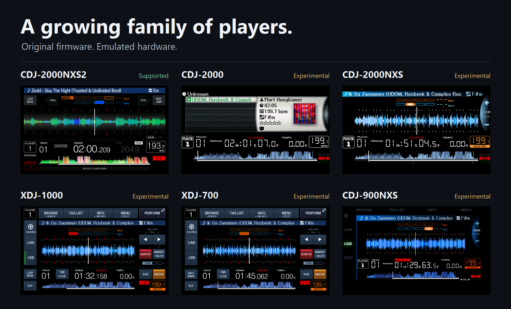
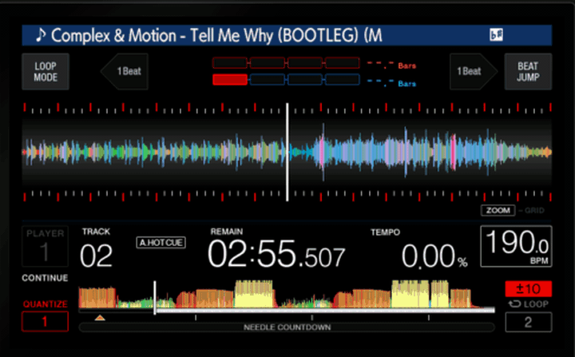
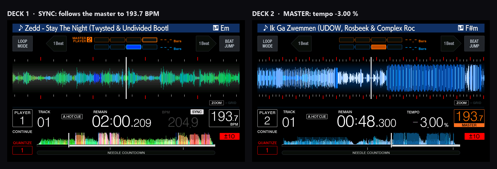
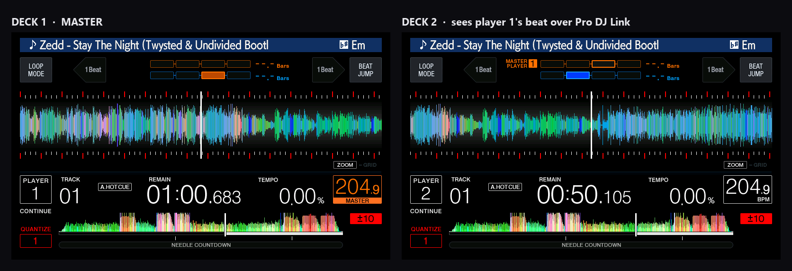
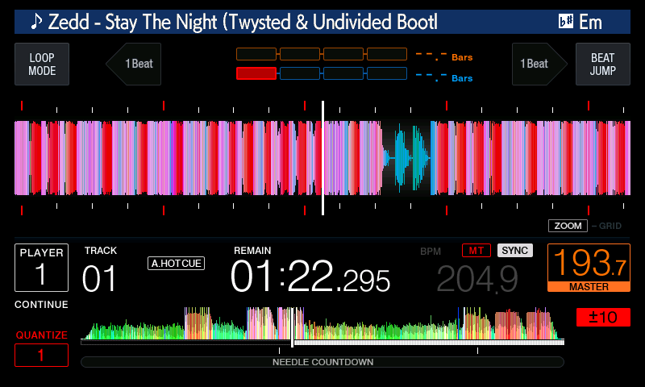
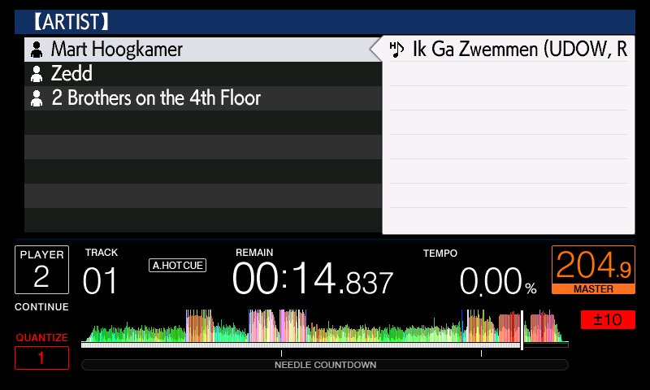
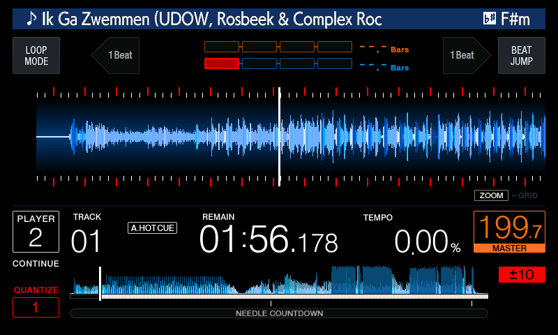
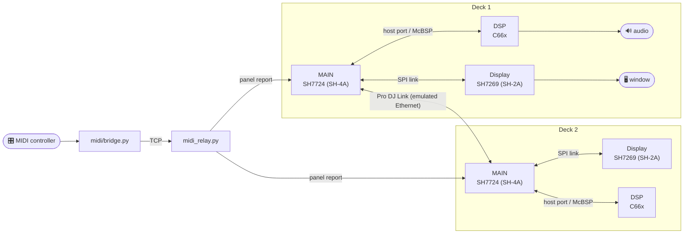
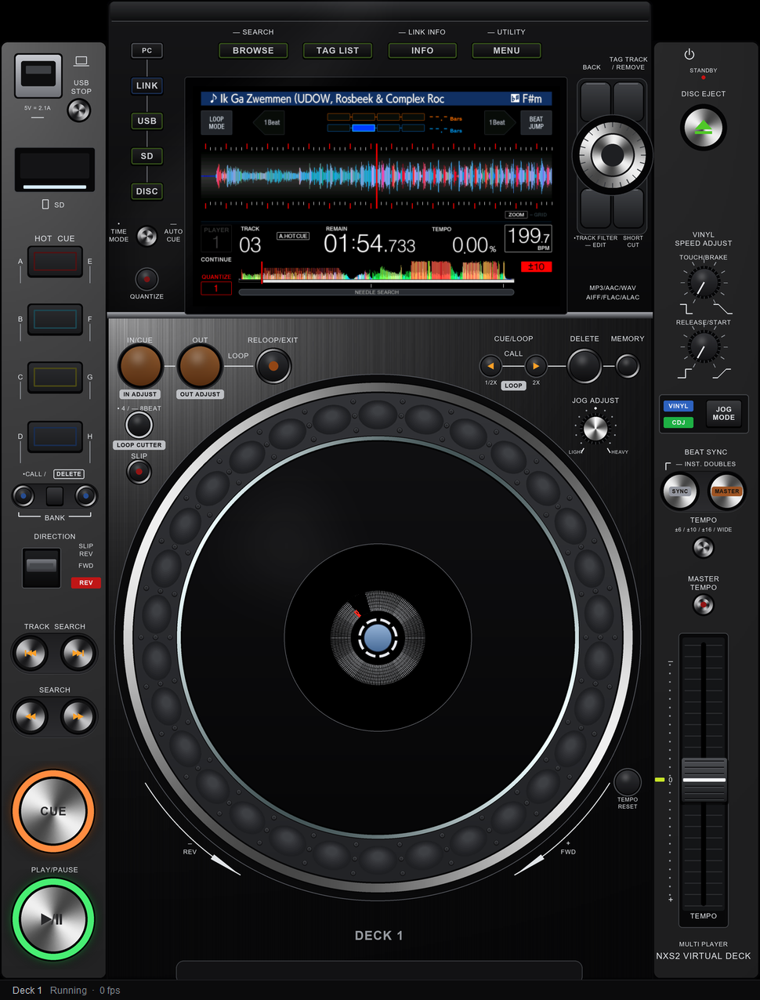

<div align="center">

# Pioneer CDJ & XDJ Emulator

**Original firmware. Emulated hardware.**

Pioneer DJ players on your computer, from the CDJ-2000 to the NXS2 and XDJ family.

[](LICENSE)
[](#quick-start)
[](https://www.qemu.org/)
[](#not-included)

[Quick start](#quick-start) · [Supported players](#supported-players) · [Screenshots](#screenshots) · [Virtual deck](#virtual-deck) · [Mods](#mods)

<a href="docs/img/deck-showcase.png"></a>

<sub>Actual emulator captures from development builds. Select the image for a closer look.</sub>

</div>

The **CDJ-2000NXS2** boots, mounts a virtual USB stick, and loads and plays tracks from it. The waveform
scrolls, the time counts down, and the sound you hear is computed by the
player's own DSP program on an emulated DSP. Start two and they find each other
on an emulated Pro DJ Link network, where MASTER and SYNC work between them.
Plug in a MIDI controller and it plays them, or use the [virtual deck](#virtual-deck).

**The family is growing.** Seven older players now have experimental emulation,
with further models in development. Support varies by model and branch; the
[status table](#supported-players) separates usable features from ongoing work.

## Features

The features below are the CDJ-2000NXS2's; the older players are covered under
[Supported players](#supported-players).

| | |
|---|---|
| 🎛️ **The real firmware** | All three processors of the player run its own code: MAIN, the display board and the audio DSP. |
| 🔊 **The DSP's own sound** | A C66x emulator with a JIT runs the DSP program MAIN uploads at boot; the audio you hear is its output. |
| 📈 **Load and play** | A track from the stick loads and plays; the waveform and playhead move, the time counts down. |
| 🔗 **Pro DJ Link** | Two decks take their own addresses from a small DHCP server, announce themselves, and MASTER and SYNC work between them. |
| 🎚️ **Any MIDI controller** | A profile of what the controller sends plus a mapping to CDJ keys. A Roland DJ-202 mapping is included, with its LEDs mirroring the player's lamps. |
| 🌀 **Jog and touch** | The jog bends the DSP's playback speed through the firmware's own jog engine; a click in the window is a touch on the screen. |
| 🧪 **Built for modding** | Trace any firmware address, watch memory, change it while it runs, call firmware functions, script every input. |

<a id="supported-players"></a>

## Supported players

The CDJ-2000NXS2 is the fully supported player. The six older models below
are experimental: playback is far slower than real time, so their sound is
chopped (it is on by default; `NOSOUND=1` turns it off). Screenshots show the firmware interface, not a claim of feature parity.

| player | status | what works |
|---|---|---|
| **CDJ-2000NXS2** | ✅ Fully supported | Boots, loads and plays tracks from USB: the waveform and playhead move and the time counts down. The sound is computed by the firmware's own DSP program. Pro DJ Link, MIDI controllers and [mods](#mods). |
| **CDJ-2000** | 🧪 Experimental | Boots with its display and keys, loads a track from USB and plays it forward, far slower than real time: the playhead moves and the time counts down. As on a real deck with AUTO CUE off (the factory setting), a loaded track starts playing straight away; PLAY pauses and resumes. The music and pitch are right, but the sound is chopped where the DSP cannot keep up. |
| **CDJ-2000NXS** | 🧪 Experimental | The same as the CDJ-2000, but its DSP lags like the XDJ-1000's: the playhead and the time start moving a few minutes after the load. Sound as on the CDJ-2000: chopped. |
| **XDJ-1000** | 🧪 Experimental | Boots with its screen and keys, loads a track from USB and plays it, but at about a tenth of real speed: the playhead and the time start moving a few minutes after the load. PLAY pauses and resumes. Sound is on and chopped. |
| **XDJ-700** | 🧪 Experimental | The XDJ-1000's board: the same as above. |
| **CDJ-900NXS** | 🧪 Experimental | The XDJ-1000's board. Boots, loads a track from USB and plays it, as slowly as the XDJ-1000: the waveform moves and the time counts down. |
| **XDJ-1000MK2** | 🧪 Experimental | The XDJ-1000's board on its own firmware. Loads a track from USB and plays it as slowly as the XDJ-1000; PLAY pauses and resumes, and CUE returns to the cue point when AUTO CUE is on. |
| **CDJ-900** | 🧪 Experimental | The CDJ-2000's platform with a smaller display. Boots, loads a track from USB and plays it: the overview playhead moves and the time counts down. The window shows its dot-matrix display (source line, track info, overview) with the time readout below it. |

Everything below, from the quick start on, describes the CDJ-2000NXS2 unless it
says otherwise.

<a id="not-included"></a>

## Nothing from Pioneer DJ is included

> **This repository distributes no firmware, no ROM or flash images, no fonts,
> no artwork files and no manuals or schematics.** Everything here was written
> for this project. To run it you supply your own copy of the public
> firmware update file for the player, which the setup unpacks on your machine, into a folder
> that is never committed.
>
> The screenshots in this README show the emulated firmware's own interface, running in
> this emulator, for illustration.
>
> This project is not affiliated with, endorsed by or supported by Pioneer DJ or
> AlphaTheta. Pioneer DJ, CDJ, rekordbox and PRO DJ LINK are trademarks of their
> respective owners.

<a id="quick-start"></a>

## Quick start

**1. Get a shell for your system** (only your own line applies):

| system | what to do first |
|---|---|
| **Windows** | Install [MSYS2](https://www.msys2.org) and open the **MSYS2 MINGW64** shell. `setup.sh` tells you which packages to add. |
| **Linux** (native or WSL) | Nothing. Any shell will do; `setup.sh` prints the `apt` command for anything missing. |
| **macOS** (Apple silicon or Intel) | Install the Xcode Command Line Tools and [Homebrew](https://brew.sh), then the build tools and a newer bash (macOS's own is 3.2; the scripts find Homebrew's by themselves): `xcode-select --install` then `brew install bash ninja meson pkgconf glib pixman python` |

**2. Clone and run setup** (the same on every system):

```sh
git clone https://github.com/Stijn-Jacobs/cdj-nxs2-qemu.git cdj-nxs2
cd cdj-nxs2
./setup.sh
```

`setup.sh` walks you through seven steps. Every one is safe to re-run and is
skipped when it is already done:

1. **Prerequisites** — checks compilers, libraries and Python packages, and
   prints the exact `pacman`, `apt` or `brew` command for whatever is missing.
2. **Build** — fetches QEMU 9.1.0, applies this project's patches and builds
   the MAIN emulator, the display-board emulator and the DSP library, with a
   progress line per phase and full logs in `logs/` (10–40 minutes).
3. **Firmware** — asks for your `C2KNXS2.UPD`, Pioneer DJ's public update for
   the CDJ-2000NXS2, **version 1.87**, and turns it into the images the
   emulator boots, checking each against a known SHA-256.
4. **USB stick** — either a folder of your own music exported by rekordbox
   (the folder that holds `PIONEER/`), or a plain folder of music files
   (MP3, FLAC, AAC/M4A, WAV, AIFF, ALAC), which
   [baken](https://github.com/M-Igashi/baken) analyses instead — no
   rekordbox needed. Either way, a disk image is built from the result.
5. **DSP code** — boots one deck without a window and lets it play a track for
   a few minutes while MASTER TEMPO and the tempo fader are swept, so the DSP's
   JIT compiles the program's hot code into its cache (`~/c14gen`) and your
   first real session already keeps up (about 15 minutes).
6. **Your setup** — one deck or two, Pro DJ Link, sound, a MIDI controller;
   saved to `cdj.conf`.
7. **Mods** — small on/off tweaks to how the deck behaves: take the defaults
   in one answer or choose each (see [Mods](#mods)); saved alongside your setup.

**3. Play:**

```sh
./start.sh          # Ctrl-C stops everything
```

The deck window opens and the CDJ-2000NXS2 boots to its screen. Click the window,
press `U` for the USB stick, `↓` to a track, `Enter` to load it and `Space` to
play (every key: [Keyboard](#keyboard)). Click the screen to touch it.

**Other players:** the CDJ-2000, CDJ-2000NXS, CDJ-900, XDJ-1000, XDJ-700, XDJ-1000MK2 and CDJ-900NXS
start from the same two commands with `--model`; plain `./setup.sh` also asks
which player you want (Enter keeps the CDJ-2000NXS2):

```sh
./setup.sh --model cdj2000 --firmware path/to/C2KGUI.UPD   # the others of the four files beside it
./start.sh --model cdj2000                                  # or cdj2000nxs, with its C2KNXS.UPD; cdj900 takes the four C900*.UPD
./setup.sh --model xdj1000 --firmware path/to/XDJ1000.UPD  # v1.13; xdj700 takes XDJ700.UPD v1.15,
./start.sh --model xdj1000                                  # cdj900nxs C900NXS.UPD v1.31
```

On the XDJ-1000, XDJ-700 and CDJ-900NXS only `U` (USB), `Enter` (the select knob's push) and `Space`
(PLAY) are mapped so far: `U` and seven `Enter`s load the first track.

Setup stores the player in `cdj.conf`, so `./start.sh` alone starts it from
then on. An older player gets the build, firmware and USB steps and opens one
window with your stick; a second deck, Pro DJ Link, MIDI controllers, mods and
the virtual deck app are CDJ-2000NXS2 features and are skipped. The
CDJ-2000NXS and XDJ-1000 also get setup's step 5, which records one headless
deck playing and builds their DSP module from it (about an hour); `./start.sh`
loads it from `~/c14gen/curated-<player>/`. Which players exist is whatever has a profile in `models/`.

**Updating:** `git pull`, then `./start.sh` as usual. The emulator is compiled,
so when a pull changed its code `start.sh` notices and offers to rebuild
(`./build.sh main display` does the same by hand).

**You will need** a recent multi-core CPU (see [Limits](#limits)),
about 3 GB of disk for the build trees and the DSP code cache, Python 3.11 or
newer, the update file (v1.87 — every address in the model is for that
version), and your own music.

<details>
<summary><b>On macOS</b></summary>

- The deck window is QEMU's native **Cocoa** window and the sound goes to the
  default output through **Core Audio**; neither needs anything from
  Homebrew. `GUI_DISPLAY=sdl` and `AUDIODEV=...` choose others, as elsewhere.
- **Pro DJ Link** runs over multicast on your network interface. The first
  time, macOS may ask whether your terminal may find devices on the local
  network: allow it, or the two decks will not see each other.
- The DSP JIT compiles with Apple's clang (`gcc` on macOS is clang), and
  `--curated-jit` uses clang's own profile-guided build with Xcode's
  `llvm-profdata`.
- Python packages go into `.venv/` in this folder, since Homebrew's Python
  refuses `pip install` outside a virtual environment; setup offers the exact
  command. QEMU 9.1's configure needs `distlib`, which current `pip` no longer
  carries, so the build makes itself a small venv with it in the build tree.
- Over `ssh`, with no desktop session, the decks run without a window.

</details>

<details>
<summary><b>Setup options</b></summary>

```text
./setup.sh --dry-run            show every step and command, change nothing
./setup.sh --reconfigure        ask the "your setup" and "mods" questions again
./setup.sh --yes                never ask; take the defaults and the options below
./setup.sh --skip-build         leave the build out (a build tree you made yourself)
./setup.sh --rebuild            build even when the emulators are already built
./setup.sh --no-warm            leave the DSP warm-up out
./setup.sh --warm               warm the DSP code cache again
./setup.sh --curated-jit        build a profile-guided DSP module instead (about an hour)
  --keep-recording              keep that build's DSP recording (~10 GB)
  --firmware <file>             the C2KNXS2.UPD to use (re-installs the images)
  --music <folder>              the rekordbox USB export to image
  --tracks <folder>             a plain folder of music to image instead, analysed by baken
  --decks 1|2   --name <deck name>   --djlink on|off   --audio on|off
  --controller none|<profile>|learn  --relay-port <port>
  --build-dir <dir>             where the two QEMU build trees go

./start.sh stop                 stop a running rig from another shell
./start.sh --dry-run            show what would be started
./build.sh [source|patches|main|display|dsp]   one build phase at a time
```

</details>

<a id="screenshots"></a>

## Screenshots

### CDJ-2000NXS2 in motion

<p align="center">

</p>

### Pro DJ Link and performance

<p align="center">
<a href="docs/img/hero.png"></a>
</p>

<details>
<summary><b>More Pro DJ Link screens</b></summary>

<table>
  <tr>
    <td align="center"><br><sub>Deck 2 tracks the master's beat over Pro DJ Link</sub></td>
    <td align="center"><br><sub>MASTER TEMPO and SYNC, colour waveform</sub></td>
  </tr>
  <tr>
    <td align="center"><br><sub>Browsing the other player's USB over the link</sub></td>
    <td align="center"><br><sub>...and playing a track loaded from it</sub></td>
  </tr>
</table>

</details>

## How it works

A CDJ-2000NXS2 is three computers in one box, and all three run here (the
older players are built the same way, from their own parts):

| chip | job in the player | here |
|---|---|---|
| Renesas SH7724 (SH-4A) | **MAIN**: transport, file system, rekordbox database, Pro DJ Link, the front panel | QEMU's SH-4 with a board model written for this project (`hw/cdj/`) |
| Renesas SH7269 (SH-2A) | the **display processor**: draws the 7-inch screen from what MAIN sends it | a second, big-endian QEMU with its own board model (`hw/cdj/boards/nxs2/sh7269gui.c`) and a window on your desktop |
| TI TMS320C6655 (C66x) | the **DSP**: decodes the track, time-stretches it, produces the audio | a C66x core written for this project (`hw/cdj/c6x/`), running the program MAIN uploads to it at boot |


```mermaid
flowchart LR
    subgraph deck1["Deck 1"]
        direction LR
        MAIN1["MAIN<br/>SH7724 (SH-4A)"] <-- "SPI link" --> GUI1["Display<br/>SH7269 (SH-2A)"]
        MAIN1 <-- "host port / McBSP" --> DSP1["DSP<br/>C66x"]
        DSP1 --> AUDIO1(["🔊 audio"])
        GUI1 --> WIN1(["🖥️ window"])
    end
    subgraph deck2["Deck 2"]
        direction LR
        MAIN2["MAIN<br/>SH7724 (SH-4A)"] <-- "SPI link" --> GUI2["Display<br/>SH7269 (SH-2A)"]
        MAIN2 <-- "host port / McBSP" --> DSP2["DSP<br/>C66x"]
    end
    MAIN1 <-- "Pro DJ Link (emulated Ethernet)" --> MAIN2
    CTRL(["🎛️ MIDI controller"]) --> BRIDGE["midi/bridge.py"] -- TCP --> RELAY["midi_relay.py"] -- "panel report" --> MAIN1
    RELAY -- "panel report" --> MAIN2
```

The CDJ-2000 and CDJ-2000NXS have a board model of their own
(`hw/cdj/boards/cdj2000/`): an SH7763 MAIN, a Blackfin BF531 display
processor, and a DSP behind a host port (a C6727 on the CDJ-2000, a C6747 on
the CDJ-2000NXS). The XDJ-1000, XDJ-700 and CDJ-900NXS share the NXS2's
SH7724 MAIN, which draws their screen itself, with a C6747 DSP
(`hw/cdj/boards/xdj1000/`). The CDJ-2000NXS and XDJ-1000 keep up once setup has built their DSP
module; the other older players' DSPs are too slow, so their sound is chopped, and the
launcher starts each in one window (see Quick start, other players).

None of the three knows it is emulated. MAIN talks to the display processor
over the same SPI link, to the DSP over the same host port and McBSP audio bus,
and reads its front panel through the same report from the panel
microcontroller as on the real board. The models were written device by
device, from what the firmware actually touches.

**How it was done.** By reverse engineering, under QEMU, one blocked boot at a
time. The firmware update was unpacked (its container, the LZSS packing of the
MAIN and display images, the resource archives), and the boards were modelled
wherever the firmware stopped: interrupt controllers, DMA, I²C, the USB host
controller, the Ethernet MAC, the SPI link between the two processors, the
DSP's boot path and command protocol. The firmware turned out to be its own
best documentation: it logs to an internal ring, it names its tasks, its keys
and its errors, and a trace hook at any firmware address plus a memory watch
said the rest.

**The NXS2's DSP** needed the most work. There is no usable C66x emulator, so this
project has its own: a VLIW core that issues up to eight instructions a cycle,
with the SoC peripherals the program uses. Interpreted, it is far too slow for
real-time audio, so a **JIT** compiles the hot parts of the DSP program to
native code while you play (`hw/cdj/c6x/tools/`), caching what it has built.
The instruction decode tables come from GNU binutils.

<a id="keyboard"></a>

## Keyboard

No controller needed: click a deck's window and play it from the keyboard.
Each window drives its own deck.

| key | does | key | does |
|---|---|---|---|
| `Space` | PLAY/PAUSE | `C` | CUE (held, as on the deck) |
| `↑` / `↓` | turn the browse knob | `PgUp` / `PgDn` | ten rows at a time |
| `Enter` / `→` | push the knob: open a folder, load a track | `Esc` / `←` / `Backspace` | BACK |
| `,` / `.` | TRACK previous / next | `[` / `]` | SEARCH back / forward (held) |
| `-` / `=` | nudge slower / faster while held (`Shift` for more) | `Q` / `W` / `E` | LOOP IN / OUT / RELOOP |
| `B` | BROWSE | `M` | MENU (UTILITY) |
| `U` / `L` / `R` / `D` | USB / LINK / REKORDBOX / DISC source | `T` / `I` | TAG LIST / INFO |
| `S` | SYNC | `A` | MASTER |
| `K` | MASTER TEMPO | `P` | TEMPO RANGE |
| `V` | SLIP | `Z` | REVERSE |
| `J` | JOG MODE | | |

The mouse is the touch screen. A typical start: `U` (or click the source), `↓`
to a track, `Enter` to load, `Space` to play.

<a id="virtual-deck"></a>

## The virtual deck app

<p align="center">

</p>

A full player drawn around the emulated screen instead of a bare window:
source and browse keys, the rotary selector, hot cue pads, the loop section,
CUE and PLAY, a jog with its centre display, the tempo fader. Everything on
it is drawn by the app itself; no photo, logo or artwork of the real unit is
used.

```sh
./start.sh --app          # or CDJ_APP=1 in cdj.conf; --no-app for the plain window
```

<details>
<summary><b>Mouse and keyboard</b></summary>

| you do | the deck gets |
|---|---|
| click a key | the key, held for as long as the mouse button is |
| drag the jog round | the platter turning: the rim bends the track, the top plate is touch-sensitive |
| mouse wheel over the jog | a nudge |
| wheel over (or drag) the rotary selector, click its centre | turn, push |
| drag the tempo fader | the tempo slider |
| click the screen | a touch |
| type | the [keyboard](#keyboard) map, to the deck under the mouse |
| `F2` | the screen beside the face at full size, on/off |
| `F3`, or right-click the screen | the screen in a window of its own (resizable, `F11` full screen) |

</details>

<details>
<summary><b>Lamps</b></summary>

The lamps are the deck's own: PLAY, CUE, SLIP, MASTER TEMPO and the jog ring
light and blink from MAIN's panel-lamp frame, and the jog's centre display
turns with the firmware's own pointer. Keys whose report bit is decoded from
the firmware but not yet tried on a running deck carry a small amber ring;
keys with no known report bit (hot cues, BANK, QUANTIZE, TRACK FILTER, SHORT
CUT, the vinyl speed knobs, the needle strip) are drawn but do nothing.
Hovering a control says which is which in the status line.

</details>

<details>
<summary><b>A bigger screen</b></summary>

The NXS2's 7-inch screen is a small part of a tall deck, so a face that fits
a monitor shows it at about half size. `F3` opens a deck's screen in a
window of its own at any size (`F11` there for full screen); `F2` docks it
beside the face at its own 800 x 480 instead. The default is the decks
alone (`--screen face|dock|window|auto`, or `CDJ_APP_SCREEN`).

</details>

<details>
<summary><b>Two decks</b></summary>

With two decks (`CDJ_DECKS=2`) both stand side by side in one window, find
each other over the emulated Pro DJ Link, and MASTER and SYNC light up
between them, same as the real players. Closing the window, or Ctrl-C,
stops the decks.

</details>

<details>
<summary><b>Stuck on "Waiting for the screen"</b></summary>

The screen comes from each deck's display board, a QEMU of its own. After
45 seconds without it the status strip says why, and the terminal prints the
end of that board's log (`bridge-gui-show1.log` in `/tmp`, or the system's
temp folder on Windows). `logs/app.log` records every attempt the app made
to reach each screen. Those two files are what to send with a bug report.
The emulator itself prints little; `CDJ_REPORT=1` brings back its exit reports
for diagnostics.

</details>

<details>
<summary><b>How it is built</b></summary>

Pillow draws the face and pygame-ce (SDL) puts it on screen; both are in
`requirements.txt`, which `./setup.sh` installs into `.venv/`. The window is
laid out in points and drawn in the display's own pixels, so on a Retina Mac
or a scaled Windows display the face is drawn at 2x (or whatever the
display's density is) rather than stretched. The face is drawn once per
window size with anti-aliasing and every lamp is a small pre-drawn image, so
a lamp or the jog costs almost nothing per frame and the time goes to the
screen: about 4 ms for an 800 x 480 frame at 2x on an Apple-silicon Mac, with
the window shown at the display's refresh rate (120 Hz there). The app talks
to the deck three ways:

- **the screen** comes from a frame file the display board writes whenever
  its picture changes (`CDJ_GUI_FRAME_FILE`, checked up to 120 times a
  second), so every frame the firmware draws is shown: with the
  `high_fps` mod about 70 a second while zoomed in on a playing track.
  QEMU's VNC server, the portable alternative, stops at 33 updates a second
  and is kept only as the fallback for an older build;
- **the touch screen and the keyboard** go over that VNC server (loopback
  only, one port per deck from 5921, or the next free one: the launcher
  tells the app which), straight into the display board's own
  touch and key handlers, exactly as with the plain window;
- **the drawn controls and the lamps** go through the controller relay, the
  same path and the same key table (`midi/cdj_actions.py`) as a MIDI
  controller, which can stay connected alongside.

</details>

<a id="mods"></a>

## Mods

Small on/off tweaks to how the deck behaves, each with its own default,
listed in `mods/mods.conf`:

| mod | what it does | default |
|---|---|---|
| [`high_fps`](mods/high_fps/README.md) | Draw the zoomed-in waveform about twice as often (~70 fps instead of ~33). | on |
| [`live_clock`](mods/live_clock/README.md) | Repaint the REMAIN clock every frame instead of about three times a second. | on |
| [`three_band`](mods/three_band/README.md) | Draw the centre waveform and the overview as three bands (low blue, mid amber, high white), CDJ-3000 style, from the track's own 3-band data (.2EX). | off |
| [`phrase`](mods/phrase/README.md) | Draw a coloured phrase band along the bottom of the overview strip, CDJ-3000 style, from the track's own phrase analysis in its `.EXT` file; tracks without it get no band. | off |
| [`osc`](mods/osc/README.md) | Send the deck's beats, state and load/play/stop/cue/loop events as OSC messages on UDP broadcast port 50010, for lighting desks and scripts. | off |
| [`usb_midi`](mods/usb_midi/README.md) | Send MIDI Start, Stop, Continue and Timing Clock over the rear USB-B port, so a DAW or drum machine follows the deck. | off |
| [`ableton_link`](mods/ableton_link/README.md) | Join Ableton Link as a peer: Live or any Link app on the deck's network follows its tempo and beat. | off |
| [`tcnet`](mods/tcnet/README.md) | Act as a TCNet Master node, broadcasting the deck's play position, track length, beat in the bar and play state on UDP 60000/60001 and answering Metrics (BPM, speed) and MetaData requests on UDP 65023, so ShowKontrol, Resolume or other TCNet receivers can follow it. | off |

Each mod has a page of its own: its knobs, what it patches, and what has and has
not been verified. `osc` needs a relay on the emulator
(`python3 scripts/net/osc_relay.py`, see its page); `ableton_link` is reached
through [a TAP adapter](#rekordbox-ableton).

`./setup.sh` shows the defaults (step 7) and either takes them or asks about
each one, and saves your answers to `cdj.conf`; `./setup.sh --reconfigure`
asks again. You can also edit `cdj.conf` directly,
or override any of them for one run with the environment, e.g.
`CDJ_GUI_FRAME_MS=0 ./start.sh` (a caller's own environment always wins over
`cdj.conf`).

[SERVICE MODE](#service-mode) is a separate boot option, not a mod: it changes
what the deck boots into, not how it behaves once it is up.

**Patching a real firmware update.** `three_band`, `phrase`, `osc`, `usb_midi` and
`ableton_link` are firmware code patches, not emulator knobs: the launcher
applies the display ones to a copy of the display image at boot
(`mods/patch_gui.py`) and the MAIN ones to a copy of the MAIN image
(`mods/patch_main.py`), the same code a real update would carry.
`mods/patch_update.py` makes the same patches to a real Pioneer `.UPD` file, so
they end up on an actual player instead of a copy this emulator throws away on
exit; each mod's page gives its command, for example:

```sh
python mods/patch_update.py C2KNXS2.UPD C2KNXS2-link.UPD ableton_link
```

MAIN has no scatter-load table of its own: it runs in place, so a mod's routine
goes straight into a run of erased flash inside its own address space rather
than being copied out to RAM the way a display patch is.

Only a mod that is an actual firmware code patch is offered this way — an
emulator-only knob such as `high_fps` or `live_clock` has nothing to
write into a real update, and does not appear. `python mods/patch_update.py
--list` shows what is available and which firmware version it was verified
against; a mismatched version is refused unless you pass `--force-version`.
**Combining mods.** Name as many as you like in one command, e.g.
`python mods/patch_update.py C2KNXS2.UPD out.UPD three_band osc ableton_link`.
Each name brings every patch its row in `mods/mods.conf` needs. All routines
of one image are placed in a single pass into one free area, so they cannot
overlap, and mods that hook the same spot in the firmware share it: the spot
is replaced once by a stub that runs the original code and then each mod in
turn. The launcher combines the mods you switched on the same way.

**This is untested on real hardware.** The container repacking and the LZSS
re-encoding have been checked against the real update file byte for byte, and
the patched image has been checked against `patch_gui.py`'s/`patch_main.py`'s
own output (see `tests/`), but nobody has flashed a patched update into an
actual player. Flashing a modified firmware update is entirely at your own
risk — keep the original file, and expect that a mistake here could mean a
trip through service mode's recovery path, or worse.

<a id="rekordbox-ableton"></a>

## Connecting rekordbox and Ableton Live on this PC

<details>
<summary><b>Setup, start command and troubleshooting</b></summary>

The decks' usual Pro DJ Link network is QEMU's multicast segment, which no
program on your PC can join. On Windows the deck can instead sit on a virtual
network adapter of your PC, and then:

- **rekordbox** on the PC is a Pro DJ Link peer of the deck. In Export mode
  they see each other, the deck browses the rekordbox library (the deck's
  REKORDBOX / LINK source) and loads and plays tracks from it.
- **Ableton Live** (12 tested) shows `1 Link` at the deck's BPM, and follows
  the deck's tempo, with the [`ableton_link`](#mods) mod on. rekordbox in
  Performance mode also lists the deck as a Link peer and syncs to it.

`ableton_link` is a firmware patch like the other [mods](#mods), and off by
default.

**One-time setup.** The adapter is the TAP-Windows6 driver that ships with
[OpenVPN](https://openvpn.net/community-downloads/) (the "TAP Virtual Ethernet
Adapter" component is enough). Install OpenVPN, then from an **elevated**
PowerShell:

```powershell
powershell -ExecutionPolicy Bypass -File scripts\net\tap_setup.ps1
```

It creates an adapter named `CDJ-Link` with its `tapctl.exe` (expected in
`C:\Program Files\OpenVPN\bin`; pass `-TapCtl <path>` if OpenVPN lives
elsewhere) and gives it the address `192.168.50.1/24`. It also caps the
adapter's MTU at 1500, adds a fixed ARP entry for the deck (`192.168.50.10`),
and opens one firewall rule on that adapter for UDP 67 (DHCP), 20808 (Ableton
Link) and 50000-50002 (Pro DJ Link). It is safe to run again, and starting a
deck afterwards needs no admin rights.

**Start the deck on it** (one deck; the rig's own DHCP server gives it
`192.168.50.10`):

```sh
DJLINK=tap:CDJ-Link bash scripts/run/rig.sh show
# with the ableton_link mod:
DJLINK=tap:CDJ-Link CDJ_MAIN_ABLETONLINK=1 CDJ_MAIN_ABLETONLINKPONG=1 bash scripts/run/rig.sh show
```

**In rekordbox**, switch to **Export mode** (the deck does not show up in
Performance mode for browsing). Once the deck has booted it appears in the
player list. On the deck press `L` (LINK) or `R` (REKORDBOX) for the source,
browse the library and load a track as from a USB stick.

**In Ableton Live**, turn on *Preferences > Link/Tempo/MIDI > Show Link
Toggle*, then press `LINK` in the transport. With the mod on, the toggle shows
`1 Link` and Live's tempo follows the deck's.

**If it does not work:**

- **`E-8309` on the deck when you load from rekordbox**: the adapter's MTU is
  not capped at 1500. TAP-Windows reports 65500, so Windows sends rekordbox's
  NFS replies as single oversized frames, which the deck drops. Run
  `tap_setup.ps1` again, or
  `netsh interface ipv4 set subinterface "CDJ-Link" mtu=1500 store=persistent`.
- **rekordbox does not see the deck**: rekordbox is in Performance mode, or it
  is sending on another adapter. Switch to Export mode; if the deck still does
  not appear, check that `CDJ-Link` is the adapter rekordbox's network settings
  use.
- **The launcher says there is no adapter of that name, or that it has no
  address**: the setup has not run, or the adapter was renamed.
- **One deck only, and Windows only.** A TAP adapter carries a single deck
  (`NDECKS=1`), and `DJLINK=tap:` is refused on other systems.

</details>

## Service mode

```sh
./start.sh --service      # or CDJ_SERVICE=1 in cdj.conf; --no-service overrides it
```

This is the service manual's own diagnostic screen: on real hardware you get
it by holding **TEMPO RANGE** and **MEMORY** while powering the unit on, until
the Pioneer logo clears, and this flag does exactly that at boot. The screen
lists BUTTON, JOG, ENCODER, NEEDLE, SLIDER VOLUME, JOG TOUCH VOLUME and JOG
RELEASE VOLUME; press or move a control and its own row lights up, so it is a
live test of every input rather than the player screen.

Both keys release once the logo clears, so nothing stays held down and the
rest of the deck is otherwise normal.

**Persistence.** By default every run boots from a shared, throwaway flash
image, so nothing you change in SERVICE MODE (or anywhere else) survives past
Ctrl-C. With `PERSIST=1` a deck keeps its own flash image between runs
(`extract/flash-<tag>.bin`), the same as a real unit's memory — a setting
changed in SERVICE MODE on a persistent deck stays changed.

## Booting from the flash

```sh
MAIN_BOOT=flash ./start.sh
```

By default MAIN starts with its firmware already unpacked into memory
(`extract/main_unpacked.bin`), past the point where the player's own
bootloader hands over. With `MAIN_BOOT=flash` it starts the way the real unit
does: from the reset vector, in Pioneer's bootloader. The firmware update's
MAIN section carries that bootloader, an emergency updater and the packed MAIN
image, at the flash addresses the player's own updater writes them to, and
`./setup.sh --firmware` lays them into `extract/flash.bin` the same way. The
bootloader sets up the clocks and memory, checks the image's checksum, unpacks
it and starts it; a damaged image starts the emergency updater instead, as on
the real player. It adds about two seconds to MAIN's start.

A `flash.bin` made by an older setup holds no bootloader; MAIN then refuses to
start and says so. Run `./setup.sh --firmware <C2KNXS2.UPD>` again to rebuild it.

## MIDI controllers

**Using one:** plug the controller in before `./setup.sh`. Setup recognises a
controller it has a profile for (or offers to learn a new one) and saves your
choice, and from then on `./start.sh` starts the bridge together with the decks.
With two decks the controller's left side plays deck 1 and its right side deck 2.
The bridge's own output is in `logs/bridge.log`. On Windows it runs on a normal
Windows Python (python.org or the Microsoft Store) with `mido` and
`python-rtmidi` installed, because MSYS2's Python cannot open MIDI devices; setup
finds it and prints the one `pip` command it needs if the packages are missing.
On macOS the packages go into this folder's `.venv/` (setup prints that command
too), and the bridge reaches the controller through Core MIDI.

Any controller works as a **profile** (what the hardware sends,
`midi/controllers/<name>.json`) plus a **mapping** (which CDJ key each control
presses, `midi/mappings/<name>.json`). The Roland DJ-202 ships with both. For
another controller:

```sh
python midi/learn.py new                          # name it, move each control, name each one
python midi/learn.py map --controller <name>      # bind controls to CDJ actions
python midi/bridge.py --controller <name> --dry-run
```

Every key of the player's front panel can be mapped, including ones nothing
binds yet. `./setup.sh --reconfigure` offers the same walk-through. Details,
the mapping format and the full action catalogue: [`midi/README.md`](midi/README.md).

## A platform for modding the firmware

Running the firmware is the first step; changing what a player does is the
next, and this is built for it. The emulator makes the whole machine
observable and every part of it adjustable, without touching a real deck:

| | |
|---|---|
| 🔍 **Watch it think** | `CDJ_FWLOG` prints the firmware's own internal log; `CDJ_FWTRACE=<address>,...` prints the registers each time execution passes an address; `CDJ_MWATCH=<address>` reports which instruction changed a memory word; QEMU's monitor dumps memory and the screen while it runs. |
| ✏️ **Change it while it runs** | `CDJ_MPOKE` holds memory at a value, `CDJ_PPOKE` writes one when a chosen instruction executes, and `CDJ_PCALL2` calls any firmware function from inside a running task. |
| 🕹️ **Drive it from outside** | Every front-panel key, the jog, the pots and the touch screen are one datagram away (`scripts/run/panel_key.py`, `midi/bridge.py`), so input can be scripted, remapped or generated. |
| 🔁 **Replay the DSP** | The DSP core can record its execution and replay it deterministically, which is what the JIT is tuned on and what a change to the audio path can be tested against. |

From here, new behaviour is a question of finding the right code and writing
the right change: remapping controls, adding features to the deck, studying the
Pro DJ Link protocol from a player that speaks it natively, or experimenting
with the audio chain. Keep what you derive from the firmware on your own
machine: the update file, and anything built from it, is Pioneer's.

### Starting from a saved deck

Booting a deck and loading a track takes minutes on the older players and
longer on the NXS2; a test or a change to the firmware's later stages should
not pay that every time. A deck can be saved while it runs and started from
that moment:

```
SNAPSHOT=loaded ./start.sh --model xdj1000      # or idle, the settled screen
```

The first start boots as usual, drives the deck to the point (the model
profile's `MODEL_IDLE_S` and `MODEL_LOAD_STEPS`) and saves it; every later
start restores it at once. Saves live in `/tmp/cdj-snap/`, one folder per
combination of QEMU build, firmware, USB image and `MAIN_ARGS`, so a rebuild or
a new stick starts a fresh save by itself; delete the folder to forget them.
A save only comes back into the machine that wrote it, so a device that gains
state needs that state in its `VMStateDescription` before saves of it restore
correctly. The USB image is not part of a save: the stick is attached as a
read-only-in-practice snapshot and comes back as the original file.

`scripts/test/quick.sh snap` is the same thing as a test: with the deck table
of `deck_smoke.py` it restores each deck's loaded point and checks that the
playhead moves (`deck_smoke.py --snapshot`). The first run saves the points,
so it takes as long as `decks2`; after that a deck takes a minute and a half.

<a id="limits"></a>

## Limits

- **Speed depends on your CPU.** One deck runs in real time on a fast desktop.
  Two decks need roughly twice that, and on a busy or modest machine they fall
  behind real time (the audio then has gaps).
- **The DSP code is compiled on your machine.** A deck keeps up only once the
  JIT has compiled the DSP program's hot code, and none is shipped, because it
  would be derived from Pioneer's code. `setup.sh` warms that cache with a few
  minutes of play; code the warm-up did not reach is compiled the first time
  you use it, with a short slow patch then. `./setup.sh --curated-jit` goes
  further: it records the DSP running your own firmware and builds one
  profile-guided module from that recording, the way the maintainers build
  theirs. It takes about an hour and ~16 GB of free disk while it runs, and the
  module is installed only if it replays the recording exactly.
- **MASTER TEMPO is heavy.** It makes the DSP program do far more work per
  sample, and it is currently the most demanding thing you can ask of the
  emulator.
- **Only firmware v1.87** is supported for the CDJ-2000NXS2.
- **Work in progress.** The older players are experimental: they load and
  play, with chopped sound and far slower than real time (see
  [Supported players](#supported-players)). On the NXS2 the USB stick is the only medium so far. Some panel
  keys are decoded by the firmware but have not been tried here; the
  controller tools say so when you bind one.

<details>
<summary><b>📁 Repository layout</b></summary>

| path | what it is |
|---|---|
| `setup.sh`, `start.sh` | the guided setup and the everyday start |
| `launcher/` | what `setup.sh`, `start.sh` and the scripts in `scripts/run/` do (`python -m launcher`), and what the portable program runs |
| `packaging/` | the portable program: `package.py` builds it for this OS, `release.sh` builds everything and then packages; a GitHub release runs that for Windows, macOS and Linux |
| `build.sh` | the build step underneath setup (`./build.sh main`, `display`, …) |
| `hw/cdj/common/` | what every board shares: the boot (DRAM, NOR flash, image, reset vector), the SH-4 core blocks and the board descriptor (`cdj_common.h`) |
| `hw/cdj/boards/nxs2/` | the CDJ-2000NXS2: its MAIN board, one file per device, and the display board (`sh7269gui.c`); `diag/` holds the diagnostic hooks, `standin/` historical models that are off by default |
| `hw/cdj/boards/cdj2000/` | the CDJ-2000 and CDJ-2000NXS: MAIN board (Renesas SH7763), Blackfin display and C6727 / C6747 DSP models, experimental |
| `hw/cdj/boards/cdj900/` and `hw/cdj/m16c/` | the CDJ-900: the CDJ-2000's MAIN board with its M16C display micro (core, SoC and the display model), experimental |
| `hw/cdj/boards/xdj1000/` | the XDJ-1000, XDJ-700 and CDJ-900NXS: their SH7724 MAIN board with its LCD controller and graphics blocks, experimental |
| `mods/` | the [mods](#mods) registry and the display- and MAIN-firmware patches behind them |
| `models/` | one profile per player, read by the firmware and launch scripts (see `models/README.md`) |
| `hw/cdj/c6x/` | the C66x DSP core, its SoC peripherals, the JIT generator (`tools/`) and unit tests |
| `patches/` | the changes to QEMU 9.1.0 itself |
| `scripts/build/` | the QEMU builds (Linux, macOS and MSYS2) and the board installer |
| `scripts/firmware/` | unpacking and verifying the update file |
| `scripts/media/` | the USB stick image builder; `collection_xml.py` and `bpm_estimate.py` turn a plain folder of music into the XML [baken](https://github.com/M-Igashi/baken) reads for the other USB step |
| `scripts/run/` | the run chain behind the launchers, the panel and monitor sockets, the controller relay and the run reports |
| `scripts/net/` | the Pro DJ Link segment: DHCP server, capture, capture scorer, and `tap_setup.ps1` for the [TAP adapter](#rekordbox-ableton) |
| `midi/` | the MIDI controller bridge, controller profiles, mappings and the learn tool |
| `app/` | the [virtual deck app](#virtual-deck): the drawn player around the emulated screen |
| `tests/`, `scripts/test/` | the offline unit tests (`python -m pytest tests`, no firmware needed) and the quick check: `scripts/test/quick.sh` runs them beside a replay of DSP recordings and a headless boot of each deck to its first stable screen (`deck_smoke.py`), in a couple of minutes |
| `docs/img/` | the screenshots on this page |

The board sources are copied into the QEMU tree on every build; edit them here,
never in `qemu-src/`.

</details>

## Licence

This project's own files are licensed under the **GNU General Public License,
version 2 or (at your option) any later version** (`GPL-2.0-or-later`); the
full text is in [`LICENSE`](LICENSE), and each file carries an
`SPDX-License-Identifier` line.

<details>
<summary><b>Third-party files and binaries</b></summary>

- The C66x instruction decode tables in `hw/cdj/c6x/binutils/` are copied from
  GNU binutils and licensed **GPL-3.0-or-later**. They are compiled into the
  MAIN emulator, so a binary built from this tree is distributed under
  GPL-3.0-or-later terms.
- `hw/cdj/boards/nxs2/standin/minimp3.h` is minimp3, released into the public domain (CC0).

QEMU itself is GPL-2.0-or-later overall, with a few GPL-2.0-only files; if you
distribute a binary, check how those parts combine with GPL-3.0. This note
describes the files' licences; it is not legal advice.

</details>

## Credits

[QEMU](https://www.qemu.org/), which this machine plugs into; GNU binutils, for
the TI C6x opcode tables; [minimp3](https://github.com/lieff/minimp3);
[baken](https://github.com/M-Igashi/baken) (MIT), which writes the USB export
for the folder-of-music setup step.
