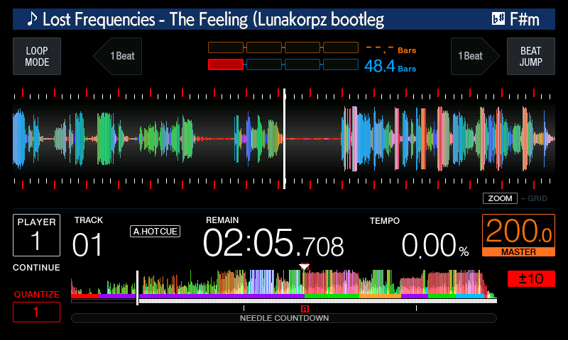

# phrase

Draws a coloured band along the bottom six rows of the overview strip, one
colour per phrase of the track, CDJ-3000 style: intro, verse, bridge, chorus,
outro, and for high-energy tracks up and down. The phrases come from the
track's own phrase analysis, the `PSSI` tag rekordbox 6 and later write into
the `.EXT` file next to it. The waveform above the band is not touched. A track
without phrase analysis gets no band and looks as it does with the mod off.

*The band is the row of colour along the bottom of the overview strip: red
intro, purple up, green chorus, orange down, purple, green, cyan outro.*

| | |
|---|---|
| knobs | `CDJ_GUI_PHRASE`, `CDJ_MAIN_PHRASEFETCH`, `CDJ_MAIN_PHRASEDATA` |
| on / off | `1` / `0` |
| default | off |

**Turning it on.** `./setup.sh` asks about it in step 7 and saves the answer to
`cdj.conf` (under `CDJ_GUI_PHRASE`; the other two follow it); `./setup.sh
--reconfigure` asks again. For one run, set all three knobs to `1` in the
environment. It combines with `three_band` and with the other mods. The
display half alone, without the two MAIN knobs, would read leftover bits of the
stock overview records as phrase colours, so they go together.

**What it changes.** It patches both firmware images, under one on/off choice:

- MAIN reads the `PSSI` and `PQT2` (extended beat grid) tags of the track's
  `.EXT` through the same tag fetch the firmware uses for its own waveform and
  grid, when it reads the colour preview. It unmasks the phrase tag (rekordbox
  6 and later scramble it with a fixed key), turns each phrase's first beat
  into a time with the grid, and fills a 600-byte table with one colour per
  column of the strip.
- MAIN writes that table into the 600 overview records it sends to the display,
  after it has copied them, one colour in each record. The display reads those
  records as two colours and two heights; the low four bits of a record's last
  byte are not read, so the colour rides there and the link needs no change. A
  record with no phrase, and every record of a track without phrase analysis,
  carries 0.
- The display firmware paints a band of that colour in the bottom six rows of
  each column that has one, after the column's own waveform pixels.

The kind of phrase picks one of the eight colours rekordbox uses for phrases
and cues, by the track's mood as rekordbox assigned it:

| kind | high mood | mid mood | low mood |
|---|---|---|---|
| intro | red | red | pink |
| verse | | blue | purple |
| bridge | | yellow | yellow |
| chorus | green | green | green |
| outro | aqua | aqua | aqua |
| up | purple | | |
| down | orange | | |

The colours and kinds are rekordbox's, from the open CueGen project; no
AlphaTheta source for the CDJ-3000's own band colours was found, so these are
rekordbox's.

It is a real code patch: `python mods/patch_update.py C2KNXS2.UPD out.UPD
phrase` writes all three into a real update. The display patch is verified
against display firmware 1.81, the MAIN patches against 1.87.

**Limits.** The beats are taken to be evenly spaced from the first to the last
beat of the grid and the track to end one beat after it. That is exact for a
fixed tempo, and off by a few columns for a track whose tempo changes. The
colour sits in bits the display reads only in a palette mode; this deck's
colour overview is read as direct colours, which is what it was verified in.

**What is verified.** In the emulator, with a real rekordbox 7 export of one
track (11 phrases, masked tag), on one deck: the mod alone loaded and played
with the playhead moving in 2 of 2 runs, the band was on the strip, and the
table MAIN builds equalled, byte for byte, the one computed offline from the
same two tags (boundaries on the columns the beats give). The code is also
run offline against that tag, an unmasked one, other moods, missing and
damaged tags. Together with `three_band`, on the same track: the playhead moved in 5 of 6
runs (in the sixth the deck loaded and drew the band but the clock had not
started when the run ended), the table was identical to the phrase-only runs
every time, and the three bands and the phrase band share the strip without
either damaging the other. On a stick whose track has no phrase analysis the
deck loaded and played in 2 of 2 runs, MAIN built no table and the strip had
no band. `three_band` alone and the unmodified firmware ran as before in 2 of
2 runs each. No run showed the E-8302 error banner.

The patch has not run on a real deck, and has been tried on one track with
phrase analysis only.

Back to the [mods](../../README.md#mods).
